**Brownie Simple Storage**

There's going to be alot to actually managing all the contracts that we work with having to write our own compile code, storage code is going to take alot of work and what if we wanted to interact with one of the contracts that we deployed in the past.Well we'd have to keep track of all the addresses and manually update our address features with an address.Maybe we didn't want to deploy a new contract every single time, maybe that we want to work with contract that we've already deployed.What if we want to work with a whole bunch of different chains like Rinkeby, mainnet, our own local net?There seems to be alot to manage here and we still haven't talked about writing tests.

**Brownie Intro & Features **

This is where brownie is going to come into play.Brownie is currently the most popular smart contract development platform buit based on python.It's used by defi giants like yearn.finance, curve.fi and badger.finance and each out having billions of dollars currently locked in value.

The reason that we learned a little bit about web3.py first because brownie heavily relies on web3.py.So let's all again but in brownie and we'll see how much easier it is to actually interact with.

**install Brownie***

Brownie is incredibly powerful and makes our lives fantastically easier.So get ready to learn one of the most powerful tools in the smart contract developing ecosystem.Let's go ahead and open up our terminal and let's get started installing brownie.It's recommended to install brownie via `pipx`.Pipx installs brownie into a virtual environment and makes it available directly from the command line.Once installed you never have to activate a virtual environment prior to using brownie.To install with pipx we can go ahead and run:

`python3 -m pip install --user pipx`

Once we run that we can run:

`python3 -m pipx ensurepath`

Then we'll want to close the terminal by hitting little trashcan and then re-open it.And then:

`pipx install eth-brownie`

and one more time we're going to close and re-open the terminal.

You can tell you've brownie installed correctly if you run

`brownie --version`

**1st brownie simplestorage project**

Let's create our first brownie project.We're going to be using exact same SimpleStorage code that we just went through except for we're going to use it in brownie.To create a sample folder with everything we need with brownie, we can just run :

`brownie init`

We'll get a new brownie project initialized in the director that we're currently in.If you type `ls`, you'll be able to see all the folders that are created or you can just seem them on your side panel in vscode.

**Brownie Folders**

Let's talk really quickly about what each of these folders is going to do.The `build` folder tracks alot of really important low-level information.It's going to track any interfaces that we're working with or deploying.It's going to keep track of all of our deployments across all of the different chains so we no longer have to manage that ourselves and it's going to store all the compiled code.

Rememer how in our SimpleStorage code we actually saved everything to `compiled_code.json`.Well brownie is actually going to do all of that for us into this build/contracts directory.So we can always reference it later.

The `contracts` directory outside the build folder is where we're going to put all of our contracts.Brownie knows to look inside of this folder when looking for new contracts to compile, deploy or anything else.

`Interfaces` is where we can save and store different interfaces.Remember how when we're working with chainlink, working with interfaces makes it really easy to interact with a blockchain application.

`Reports` are to save any type of report you run.`Scripts` where we can automate tasks like deploying, calling different functions or really anything we want.

Then we've a 'test' folder which is incredibly powerful and we're going to be using alot.We also have `.gitattributes` and `.gitignore` which are helpful when working with version control like git.

So let's go ahead and start working with brownie and really understand what's going on here.Let's add our SimpleStorage contracts to the contracts folder and copy and paste the code from the SimpleStorage that we've been using whole time.

**brownie compile & store**

Now that we've a contract we can already start working with brownie and even compile code without even having to write or work with our own compiler.All we need to do is :

`brownie compile`

Brownie will automatically read the version of the solidity and store all of the compile information in this build folder.If we go to contracts, we've SimpleStorage.json and there's alot of familier pieces here like abi, opcodes section and alot of useful information.

Great we've already compiled our smart contract.So why don't we actually deploy this to blockchain?

**brownie deploy**

To do this we've to write a script which will allow us to do whatever we want.We're going to create a new file and we're just going to call it deploy.py similar to last time inside scripts folder.

Brownie can run scripts by running `brownie run`.

If you want to take a quick minute to familiarize yourself with all the different commands that brownie has just run `brownie`

We can define that we want to run deploy.All we have to do:

**brownie runscripts/deploy. py & default brownie network**

And we can run:

And as you can see it automatically does this launching thing.Brownie defaults to always working with a local ganache-cli blockchain.It's running the exact same command that we ran earlier and it has a bunch of different flags like accounts 10, certain hardfork, certain gasLimit etc.So at the beginning of all our scripts if we don't give brownie a network to use, it'll spin up a local ganache and at the end of the script it'll tear it back down.

Typically what I like to do is put all of the logic of our deployment in its own function.

**brownie Advantages over web3. py in deploying**

In order to deploy our contract let's look back at our web3.py version of deploying this.First we compiled it but brownie does that automatically.Then we dumped into a file but brownie does that automatically.We got a bytecode and an abi but brownie does that automatically.We added a local blockchain to use but brownie autmatically spins up a local ganache.We do need an address and a private key.

**getting address & private key using Accounts package**

How do we actually get our private key and our account into brownie.Brownie has an account package that actually natively understands how to work with accounts and we can import it into our scripts.

with this account keyword we can add an account a number of different ways.If we're going to work with local chain as you saw earlier 'ganache-cli' will spin up 10 fake accounts for us and brownie automatically knows that we can work with that account.

**add default ganache account using index**

We can do something like:

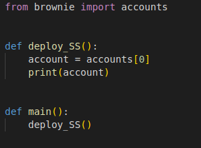

We're going to take the account that spun up at the 0th index because the accounts object is just an array.So if we run this now: It's going to spin up us an address and a private key that we can just work with without having to define a private or do anything.It does all of that for us.

We do still want to know how to add our own private keys so that we can work with the testnet.When we're working with a development network or working with brownie's automatic ganache-cli.If we want to work with testnet though, we've to do something else.

**add accounts using Commandline **

Another way to add your accounts in brownie is to use the command line and actually add them natively into brownie.We can do :

`brownie accounts new account_name`

This will then prompt us and say enter the private key that you wish to add.Let's go ahead and grab our private key from metamask and we add `0x`and the private key.

Brownie will actually password encrypt your private.After we give a password, we've a new account natively integrated into brownie.To see it we can do: `brownie accounts list` and we'll see we've our SS_account with address.

We can get rid of testing by: `brownie accounts delete SS_account`

If we want to work with SS_account that we've added to brownie via the command line, we can get it with:

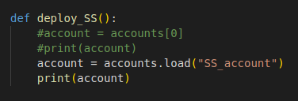

This time when we run the script, it's going to ask us the password.We need to enter the password to decrypt the account.

`Note`: If we're going to talk about safety and you want to safely secure your keys, this is one of the safe ways to do it because it's not going to store it in git, you're not accidentally push it up to github or show it to anybody and it's going to be password encrypted.

Oftentimes you're going to want to add to do a mix of working with the local ganache ones and your own keys.We'll learn how to flip back and forth between them in a little bit.

****add accounts using env variables****

The third way I like to use is still again using an environment variable script.Oftentimes it's really easy just to have your private key be an environment variable.This way you won't have to keep putting the password in every single time you run a script.It's a little bit less secure and just another tip for myself:

`Never put private keys associated with wallets that have real money in them as environment variables or in a .env file.`

Let's go ahead and create an environment variable file.Brownie has an additional feature that allows us to easily work with environment variables in an environment variable folder.We can tell brownie to always pull from our .env file in a brownie-config.yaml.It's a special file that brownie always looks for to grab information about where you're going to build, deploy and grab things.

In the yaml file all we need to do is:

`dotenv: .env`

This is telling brownie to grab the environment variables from the .env file and what we can do is.

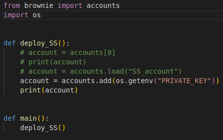

**adding wallets in yaml file and updating in account**

This seems to work perfectly but I like to make this method even more explicit.We're going to take this version that we just learned and improve it.

In our brownie-config we can actually add more information about what wallets we want to use and when we wanna use them.

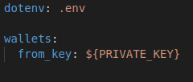

In your yaml file if you surround a string with $ sign and some curly brackets, it'll automatically get transformed into the environment variable.So if we go back to deploy, we can actually change the code:

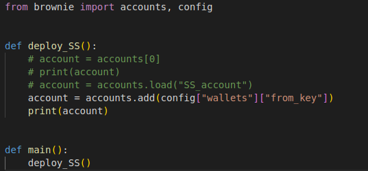

The reason that this is better because now we've one canonical place where we're always going to pull our private key from.Instead of having to go through all of our scripts and update it based on whatever we can change an environment variable.

For now let's just stick using accounts[0].Since we wanna just use the account that brownie makes for us with ganache.

****importing contract simplestorage****

Brownie is really intelligent and we can actually go ahead and import contract directly into our script.Web3.py version we opened a contract and read from it and that's how we're able to interact with it after we deployed it.

In brownie what we can do is:

SimpleStorage is just the name of the contract.

**importing & deploying in brownie vs web3. py**

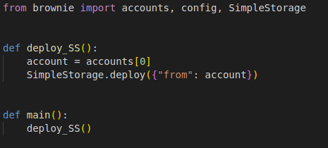

This is how we deploy to the chain.Anytime you deploy to chain or you make a transaction, you always need to do a from and say who you're going to deploying from; what's the account that's going to deploying this.

As you can see this code of just deploying is much quicker than what we did in web3.py.In web3.py we'd to get the bytecode and the abi, nonce, create the contract, create the transaction, signed the transaction and then send the transaction.

Remeber how I said before you could either make a transaction or a call.Brownie is smart enough to know whether or not what you're doing is going to be a transaction or a call.In our case since we're deploying a smart contract brownie's smart enough to know that we want to make a state change so let's make a state change.

What happened was brownie again per usual launched a local ganache chain and then sent a transaction to deploy SimpleStorage.It says SimpleStorage deployed at and the address it was deployed at.We can see how much quicker this is to actually deploy.

**recreating web3 .py script in brownie**

Let's go ahead and do exactly what we did with web3.py.Let's call initial retrieve function and we'll update the age with a new value of 15.

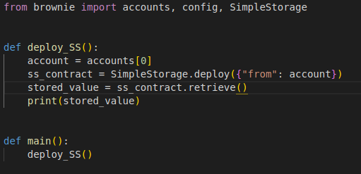

Since this is a view function, we don't have to add from account in here.We know that retrieve is a view function so we don't actually have to make a transaction.

Now let's try updating it:

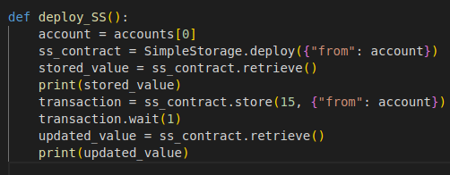

Since we're doing a transaction in brownie, we always have to add who we're going to transact from.In our case it's from: account.Similar to web3.py transaction.wait for how many blocks we wanna wait.

**tests**

Running these scripts is fantastic but we need a way to actually automate that our contracts are doing what we want them to do.We don't want to always manually check that all of our stuff is doing what we want to do.We don't want to have to manually check that 15 is actually updating appropriately.This is why running tests are so important and automating your tests is going to be crucial to becoming a successful smart contract developer.You can write tests directly in solidity and is a great way to actually test your smart contracts is to learn how to do it right in solidity.

However alot of professional developers code their tests in the smart contract development framework language like python or javascript.Doing it in this way allows you to get more flexibility and customization with what you're doing with your smart contracts and not being confined to whatever only solidity has.

So let's go ahead and learn how to actually write our smart contract tests in python.This is why the test folder is there.Create a new file called test_SS.py inside tests folder.Make sure you do add test to the front of the filename because this is the syntax that pytest is going to be looking for.

Then in our test we can set it up the exact same way we set up our deploy function.

`from brownie import SimpleStorage, accounts`

We can start defining our tests.We want to test to see that when we deploy our smart contract that it gets started off with zero in that retrieve function.So we'll create our first test.

Typically testing in smart contracts or testing really in anything is going to be seperated into three categories.
- Arrange
- Act
- Assert

We're going to bounce around and be a little bit loose with the definition.However keep in mind this is the setup you wanna use.Later smart contract examples we're going to go through a much better testing setup.

In our arrange state we're going to set up all the pieces that we need to get setup.

- In our arrange state, we're just getting our account so that we can actually make contracts.
- In out act stage w're going to deploy SimpleStorage contract, call the retrieve function to see what it's starting value is.
- We're going to compare to see if that starting value is what we expect.

We can test this with:

`brownie test`

Let's go ahead and test updating it with 15 and see if it works as we want it to.

If you wanna test just one function use -k  function_name: `brownie test -k test_deploy`

You can run `brownie test --pdb` and add something wrong in the script.Once it kicks out and is wrong, will actually put into python shell.Now we can check to see the variables of the script.

Another important flag is `-s`.It tells exactly what's going on and if we had any print lines, it'd print lines as well.

Everything you can do with brownie test is actually comes directly comes from pytest.So if there's some flag you wanna use or some awesome debugger you wanna use, you can use it with brownie just by looking at the [pytest documentation](https://docs.pytest.org/en/7.0.x/).

**Deploying to a Testnet**

We've a script to deploy, have some tests and our contract.This is great but we want to deploy to a testnet.How are we going to do this?

Let's look at back how we did with web3.py.We just needed to add http web3 provider, add our address and our private key.Brownie comes pre-packaged with a list of networks that it's already compatible with.You can see all of the networks by:

`brownie networks list`

Something important to note is that there's a difference between the development networks and the ethereum networks.Whenever we deploy to a network, we default to the development network.Any network that you see under this development section is going to be a network that is temporary.These are networks such as the temporary ganache network that brownie automatically spins up when we've run any of the scripts we've written so far.

However the ethereum ones are going to be our persistent networks.Brownie is going to keep track of our deployments and keep track of everything in there.

In our web3.py we used an rpc url or an http provider from an infura to connect to a testnet.We're going to use that exact same methodology here.How do we actually get this rpc url into our brownie smart contract package?

Well one of the easiest ways is with an environment variable.Brownie actually already knows that infura is a thing and can look natively right away for infura.

We used our project id from Infura.If we do `brownie networks list`, we can see any network that infura has access to.You can see infura in brackets.These are networks brownie will actomatically know about if we're working with infura.

If we wanted to deploy to Rinkeby, we could just run:

`brownie run scripts/deploy.py --network rinkeby`

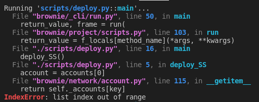

We got an issue here because accounts[0] only works when brownie works with ganache-cli.We've to use our actual private key here and that's where some of the other versions of working with private keys is gonna come into play.

Sometimes I'll even add a get account function.

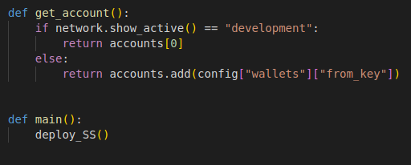

Once we've deployed to a blockchain, you'll see our build contract will actually change.Our deployment folder will have a new deployment.Everytime you deploy to a blockchain brownie will save that deployment so you can always go back see what happened with that deployment.You'll notice it's seperated by chain id.Anything that's in the development section isn't going to be saved to the deployments area.We can actually interact with contracts that we've already deployed onto a chain.

So go ahead and add new file inside scripts called read_value.py.This code will read directly from the rinkeby blockchain and it's going to read from a contract that we've already deployed.Remember we did something similar in web3.py by using the address and the abi.We're going to do the exact same thing but in brownie.

How do we actually interact with the SimpleStorage contract that we've already deployed?Well SimpleStorage object is actually just an array.If we were to print SimpleStorage, we'd get:

We can access the different indices inside of it.What if we do print SimpleStorage[0]? we'll get the address and if we check on etherscan, we can see that address is indeed the contract that we just deployed.Brownie knows that we just deployed it because again in our build section in the deployments on the rinkeby chain which has the chain id of 4, we have the contract that we've deployed.

Now we can directly interact with the contract. 

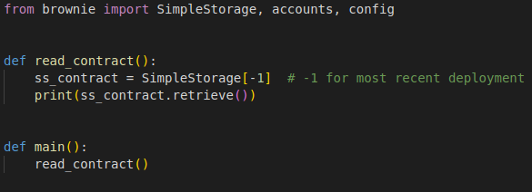

Remember how I said whenever we work with a smart contract we need to know it's abi and it's address.Brownie already knows the address and the abi which it got saved into deployments folder and json file respectively.

**Brownie console**

Now that we know how to write some scripts, deploy things with brownie and work with brownie, I'm going to show you one of the most powerful features to also work with brownie.

Typically we write our scripts when we want something to be reproducible and we want to do something over and over again.Deploying SimpleStorage or reading a value is something that we're probably going to want to do over and over again.However maybe we want to work with some of these contracts a little bit ad hoc and get into a shell where we can actually interact with these contracts.This is where brownie console is actually going to come into play.

We can run `brownie console`

Brownie will actually kick us off into a console.It has all of our contracts and everything already imported.Everything that is improted via brownie in our scripts is automatically already imported into the shell.We can go ahead and even deploy our SimpleStorage contract.We can take the deploy line and paste it on the shell and can see the deployed contract.We can do everything that we normally do in Python.

